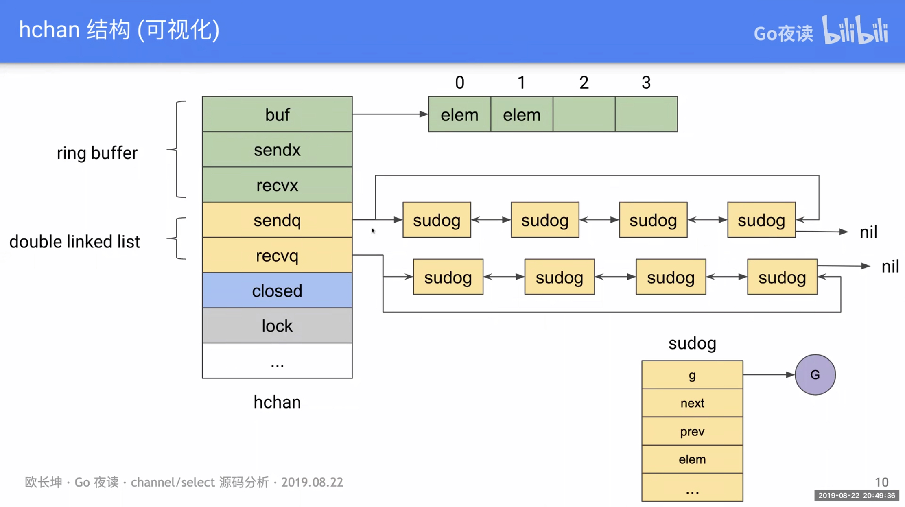

#  运行时数据结构

chan在运行时使用`runtime.hchan`结构体表示

```go
type hchan struct {
	qcount   uint                         //channel中的元素个数
	dataqsiz uint                         //环形队列的长度
	buf      unsafe.Pointer 						  //指向大小为dataqsiz 的数组
	elemsize uint16 										  //元素大小
	closed   uint32 										  //是否关闭
	elemtype *_type												//元素类型
	sendx    uint													//发送索引
	recvx    uint													//接收索引
	recvq    waitq												//接收队列
	sendq    waitq												//发送队列

	lock mutex
}
type waitq struct {
	first *sudog
	last  *sudog
}
type sudog struct {
	g *g

	next *sudog
	prev *sudog
	elem unsafe.Pointer // data element (may point to stack)

	acquiretime int64
	releasetime int64
	ticket      uint32

	isSelect bool
	success bool

	parent   *sudog // semaRoot binary tree
	waitlink *sudog // g.waiting list or semaRoot
	waittail *sudog // semaRoot
	c        *hchan // channel
}
```




# 创建

channel只能用make创建


```Go
ch := make(chan int) // ch has type 'chan int'
ch2:= make(chan int,3) // chan with buffer
```


### 先入先出 [#](https://draveness.me/golang/docs/part3-runtime/ch06-concurrency/golang-channel/#先入先出)

目前的 Channel 收发操作均遵循了先进先出的设计，具体规则如下：

- 先从 Channel 读取数据的 Goroutine 会先接收到数据；
- 先向 Channel 发送数据的 Goroutine 会得到先发送数据的权利；


# 可比较

两个相同类型的channel可以使用==运算符比较。如果两个channel引用的是相同的对象，那么比较的结果为真。一个channel也可以和nil进行比较


# 单向通道

### 只写

chan<- int

### 只读

<-chan int

# 支持操作


### 发送


### 接收


### 关闭

+ 可以通过close关键字关闭通道

+ 关闭一个nil通道或者已关闭的通道会panic

+ 编译器会将用于关闭管道的 `close` 关键字转换成 `OCLOSE` 节点以及 [`runtime.closechan`](https://draveness.me/golang/tree/runtime.closechan) 函数。

```go
func closechan(c *hchan) {
	if c == nil {
		panic(plainError("close of nil channel"))
	}

	lock(&c.lock)
	if c.closed != 0 {
		unlock(&c.lock)
		panic(plainError("close of closed channel"))
	}
  c.closed = 1

	var glist gList
	for {
		sg := c.recvq.dequeue()
		if sg == nil {
			break
		}
		if sg.elem != nil {
			typedmemclr(c.elemtype, sg.elem)
			sg.elem = nil
		}
		gp := sg.g
		gp.param = nil
		glist.push(gp)
	}

	for {
		sg := c.sendq.dequeue()
		...
	}
	for !glist.empty() {
		gp := glist.pop()
		gp.schedlink = 0
		goready(gp, 3)
	}
}
```

把这3种操作和3种channel状态可以组合出`9种情况`：

| 操作      | nil的channel | 正常channel | 已关闭channel |
| --------- | ------------ | ----------- | ------------- |
| <- ch     | 阻塞         | 成功或阻塞  | 读到零值      |
| ch <-     | 阻塞         | 成功或阻塞  | panic         |
| close(ch) | panic        | 成功        | panic         |


# 如何判读channel是否已经关闭

接收操作可以通过两个返回值接收操作的第二个参数判断：

```go
val,ok:=<-ch// 第二个参数可以判断channel是否已经关闭
```


## 使用`chan struct{}`作为信号channel


# 并发编程

## 共享内存

锁、信号量

乐观锁


悲观锁

## 顺序进程通信（CSP）

channel


go语言同时支持这两种并发编程方式


