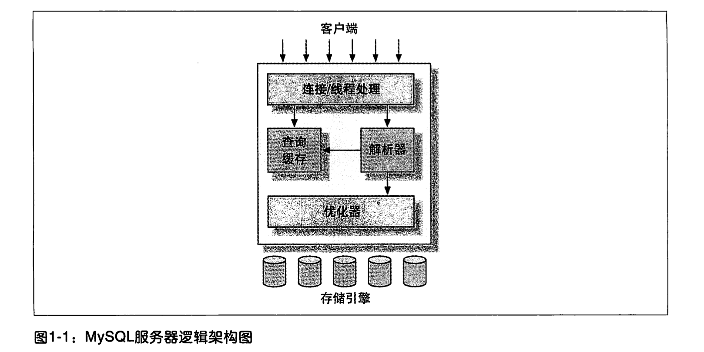

# 架构




# InnoDB 存储引擎

## 后台线程

### IO thread

insert buffer thread,log thread,read thread,write thread

### master thread 

### lock monitor thread 

###  error monitor thread


```sql
SHOW ENGINE innodb STATUS --查看引擎状态

```


## 内存

### buffer pool

### Redo log buffer

### Additional memory pool


## 关键特性

### 插入缓冲（insert buffer）

1. 索引是辅助索引

2. 索引不是唯一的


### 两次写（double write）


### 自适应hash索引


### 日志文件

#### 错误日志

#### 慢查询日志

#### 查询日志

#### 二进制日志


### 存储引擎文件

#### 表空间文件

*ibdata1*

重做日志文件

Ib_logfile0

Ib_logfile1


# 引擎

InnorDB

MyISAM

Memory


# 并发控制

## 锁机制

### 共享锁（读锁）


### 排它锁（写锁）


## 锁策略

### 锁粒度

表锁

+ alter table

+ lock table

行锁


只在存储引擎层实现


## 事务

事务是一组原子性的SQL查询

#### ACID

原子性（atomicity）、一致性（consistency）、隔离性（isolation）、持久性（durability）


`原子性`：一个事务中的所有操作，要么全部提交成功，要么全部失败回滚。 `一致性`：数据库总是从一个一致性的状态转换到另一个一致性的状态。 `隔离性`：通常来说，一个事务所做的修改在提交之前，对其他事务是不可见的。之所以说通常，因为这和事务的隔离级别是相关的。 `持久性`：一旦事务提交，则其所做的修改会永久保存到数据库中。


#### 隔离级别

**未提交读（READ UNCOMMITTED）**：一个事务可以读取其他事务未提交的修改，这也被称为“脏读”。实际中一般很少使用。

**提交读（READ COMMITTED）**：一个事务从开始到提交之前，所做的任何修改对其他事务是不可见的。这是大多数数据库系统的默认的事务隔离级别。这个级别也被称为`不可重复读`，因为在一个事务中，执行两次相同的查询，可能会得到不一样的结果。例如，第二次执行时，可以读到其他事务的提交。

**可重复读（REPEATABLE READ）**：同一个事务中，多次读取同样记录的结果是一致的。这是 MySQL 默认的事务隔离级别。另外，InnoDB 通过多版本并发控制（MVCC，Multiversion Concurrency Control）解决了幻读的问题。

**可串行化（SERIALIZABLE）**：强制事务串行执行，解决了幻读的问题。由于需要在读取的每一行数据上都加锁，因此存在大量的超时和锁争用的问题。在实际中很少使用，只有在非常需要确保数据的一致性且可以接受没有并发的情况下，才考虑使用。


#### WAL(Write-Ahead Logging)

数据更新先记录在日志中，再更新到实际的数据文件中

更新日志是顺序io,效率大于更新数据的随机io


#### 两阶段锁定协议（two-phase locking protocol）

+ 加锁阶段(自动加锁或for update ,lock in share model)

+ 解锁阶段(仅在commit或rollback时)


#### MVCC

`MVCC (Multiversion Concurrency Control)` 中文全称叫多版本并发控制，是现代数据库（包括 `MySQL`、`Oracle`、`PostgreSQL` 等）引擎实现中常用的处理读写冲突的手段，目的在于提高数据库高并发场景下的吞吐性能。


`InnoDB` 中 `MVCC` 的实现方式为：每一行记录都有两个隐藏列：`DATA_TRX_ID`、`DATA_ROLL_PTR`（如果没有主键，则还会多一个隐藏的主键列）。

**DATA_TRX_ID**

记录最近更新这条行记录的`事务 ID`，大小为 `6` 个字节

**DATA_ROLL_PTR**

表示指向该行回滚段`（rollback segment）`的指针，大小为 `7` 个字节，`InnoDB` 便是通过这个指针找到之前版本的数据。该行记录上所有旧版本，在 `undo` 中都通过链表的形式组织。

**DB_ROW_ID**

行标识（隐藏单调自增 `ID`），大小为 `6` 字节，如果表没有主键，`InnoDB` 会自动生成一个隐藏主键，因此会出现这个列。另外，每条记录的头信息（`record header`）里都有一个专门的 `bit`（`deleted_flag`）来表示当前记录是否已经被删除。


# binlog

MySQL的二进制日志binlog可以说是MySQL最重要的日志，它记录了所有的DDL和DML语句（除了数据查询语句select），以事件形式记录，还包含语句所执行的消耗的时间，MySQL的二进制日志是事务安全型的。

binlog日志有两个最重要的使用场景
1）MySQL主从复制：MySQL Replication在Master端开启binlog，Master把它的二进制日志传递给slaves来达到
master-slave数据一致的目的。
2）自然就是数据恢复了，通过使用mysqlbinlog工具来使恢复数据。


# 索引

## B+树


## HASH


## 联合索引

### 最左前缀原则


### EXPLAIN

查询执行计划


# 分库分表


当数据库数据量到达一定级别后需要对数据库进行拆分

## 水平拆分

水平切分又称为 Sharding，它是将同一个表中的记录拆分到多个结构相同的表中。

当一个表的数据不断增多时，Sharding 是必然的选择，它可以将数据分布到集群的不同节点上，从而缓存单个数据库的压力。


## 垂直拆分


垂直切分是将一张表按列切分成多个表，通常是按照列的关系密集程度进行切分，也可以利用垂直切分将经常被使用的列和不经常被使用的列切分到不同的表中。

在数据库的层面使用垂直切分将按数据库中表的密集程度部署到不同的库中，例如将原来的电商数据库垂直切分成商品数据库、用户数据库等。


### Sharding 策略

- 哈希取模：hash(key) % N；
- 范围：可以是 ID 范围也可以是时间范围；
- 映射表：使用单独的一个数据库来存储映射关系。

### Sharding 存在的问题

#### 1. 事务问题

使用分布式事务来解决，比如 XA 接口。

#### 2. 连接

可以将原来的连接分解成多个单表查询，然后在用户程序中进行连接。

#### 3. ID 唯一性

- 使用全局唯一 ID（GUID）
- 为每个分片指定一个 ID 范围
- 分布式 ID 生成器 (如 Twitter 的 Snowflake 算法)


### 主从复制

主要涉及三个线程：binlog 线程、I/O 线程和 SQL 线程。

- **binlog 线程** ：负责将主服务器上的数据更改写入二进制日志（Binary log）中。
- **I/O 线程** ：负责从主服务器上读取二进制日志，并写入从服务器的中继日志（Relay log）。
- **SQL 线程** ：负责读取中继日志，解析出主服务器已经执行的数据更改并在从服务器中重放（Replay）。

[](https://camo.githubusercontent.com/e07852d09597a9cfb719ce91e616208a17543d401a114e07ebe6e4d49e2f7dff/68747470733a2f2f63732d6e6f7465732d313235363130393739362e636f732e61702d6775616e677a686f752e6d7971636c6f75642e636f6d2f6d61737465722d736c6176652e706e67)


### 读写分离

主服务器处理写操作以及实时性要求比较高的读操作，而从服务器处理读操作。

读写分离能提高性能的原因在于：

- 主从服务器负责各自的读和写，极大程度缓解了锁的争用；
- 从服务器可以使用 MyISAM，提升查询性能以及节约系统开销；
- 增加冗余，提高可用性。

读写分离常用代理方式来实现，代理服务器接收应用层传来的读写请求，然后决定转发到哪个服务器。

[](https://camo.githubusercontent.com/7f9279aeb3dd23a8a0a64895594bd76ac9fce2dfb6bc24974a07cc83888c6fc9/68747470733a2f2f63732d6e6f7465732d313235363130393739362e636f732e61702d6775616e677a686f752e6d7971636c6f75642e636f6d2f6d61737465722d736c6176652d70726f78792e706e67)


# 慢查询优化


## 优化数据访问

是否访问了太多的行或列


## 重构查询

切分查询

分页查询

