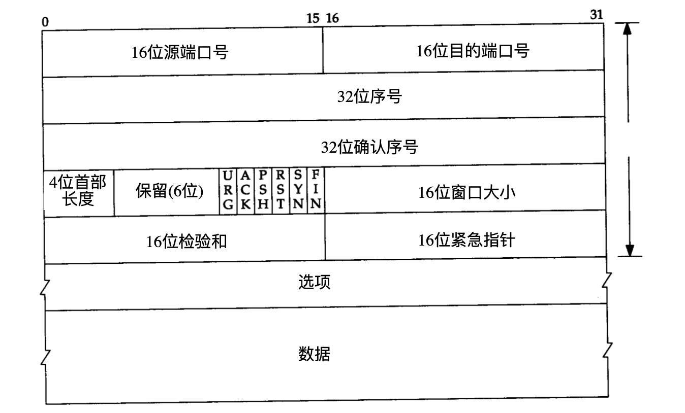
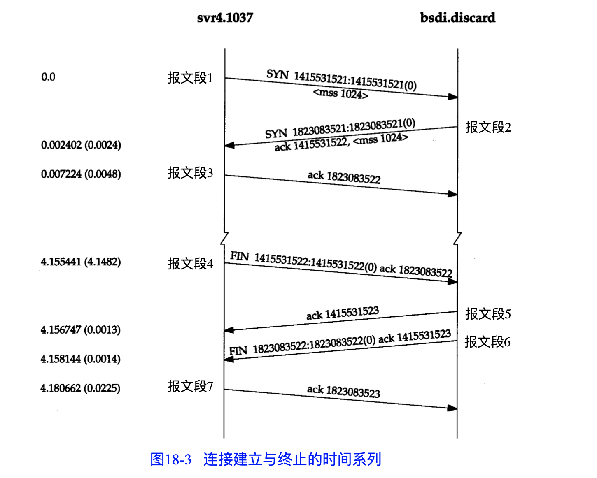
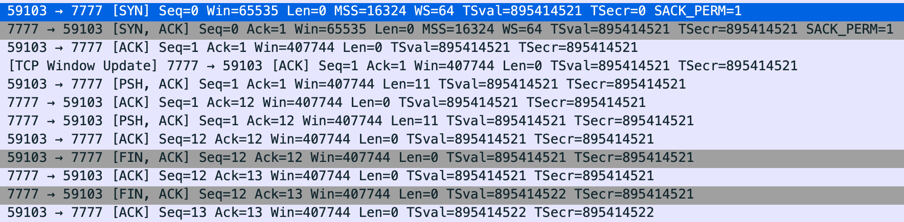
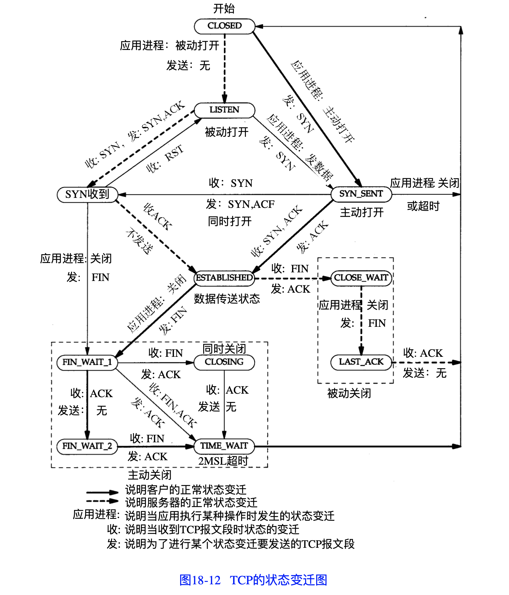
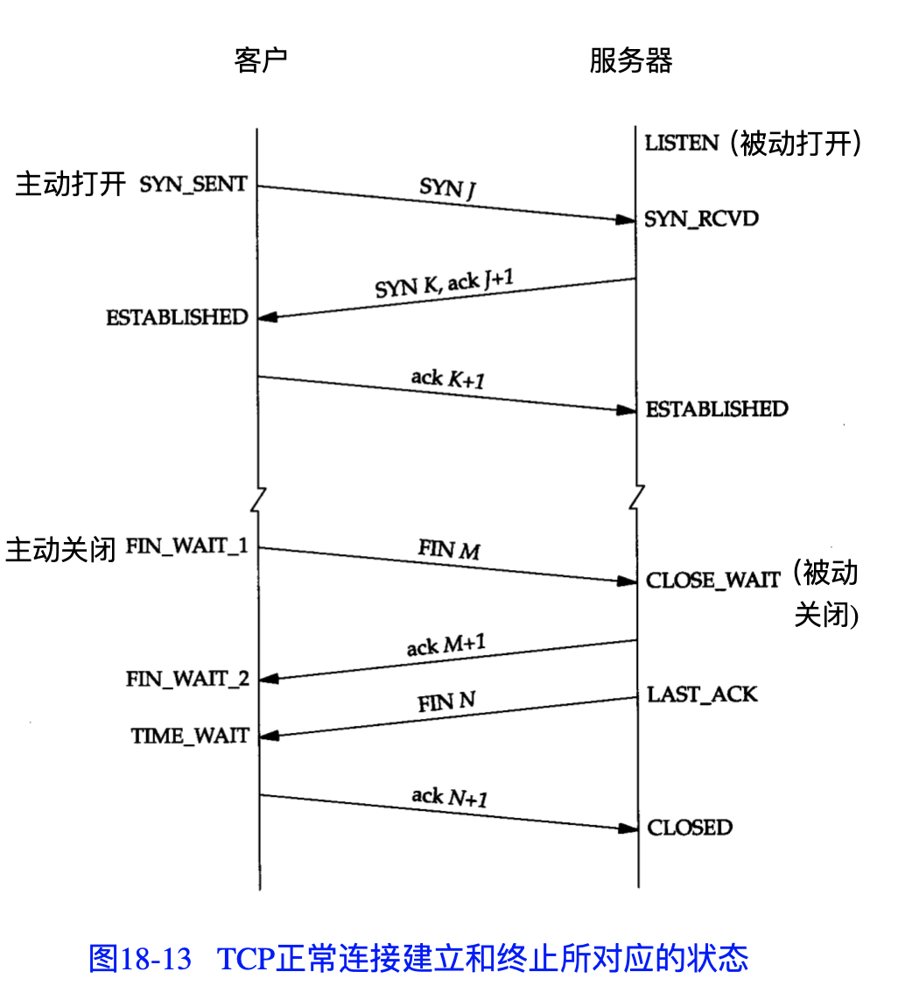
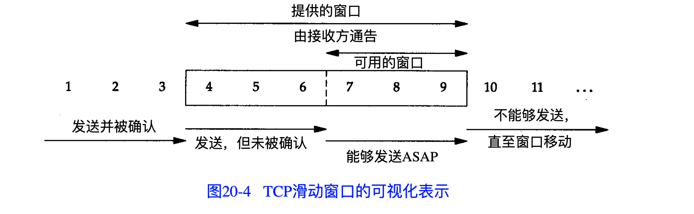
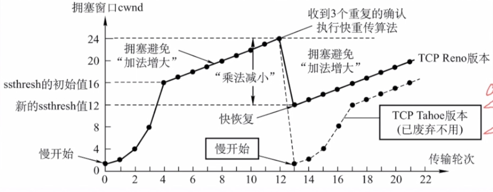

tcp提供一种面向连接的可靠的字节流服务

# 首部

- 16位源端口号
- 16位目标端口号
- 序号（Seq）对字节进行计数
- 确认序号（Ack）包含发送确认的一端所期望收到的下一个序号，只有ACK标志为1时确认序号才有效
- 4位首部长度给出首部中32bit字的数目
- 标志位
- 16位窗口大小
- 16位校验和

## 标志位

**URG**:紧急指针有效

**ACK**:确认序号有效

**SYN**:建立连接

**PSH**:发送方使用该标志通知接收方将所收到的数据全部提交给应用进程

**RST**:重建连接

**FIN**:关闭连接

## 面向连接

面向连接意味着两个使用TCP的应用在彼此交换数据之前必须先建立一个TCP连接

# 连接的建立和终止

**图 TCP抓包**

## 三次握手

1. 客户端发送一个SYN段指明客户打算连接的服务器的端口以及初始序号（ISN）

2. 服务端发回包含服务器的初始序号的SYN报文段作为应答。同时将确认序号设置为客户端的ISN+1以对客户的SYN进行确认。一个SYN占用一个序号

3. 客户将确认序号设置为服务器的ISN+1以对服务器的SYN报文段进行确认

   

## 四次挥手

关闭一个连接需要四次挥手，这是由于TCP的半关闭特性决定的，因为TCP是全双工的，因此每个方向必须单独的进行关闭

1. 主动关闭的一方关闭连接并发送FIN
2. 被动关闭方返回ACK
3. 被动关闭方关闭后返回FIN
4. 主动方放回ACK

## SYN Flood（洪泛攻击）

TCP SYN[泛洪](https://baike.baidu.com/item/泛洪)发生在OSI第四层，这种方式利用TCP协议的特性，就是[三次握手](https://baike.baidu.com/item/三次握手)。攻击者发送TCP SYN，SYN是TCP[三次握手](https://baike.baidu.com/item/三次握手)中的第一个数据包，而当服务器返回ACK后，该攻击者就不对其进行再确认，那这个TCP连接就处于[挂起状态](https://baike.baidu.com/item/挂起状态)，也就是所谓的半连接状态，服务器收不到再确认的话，还会重复发送ACK给攻击者。这样更加会浪费服务器的[资源](https://baike.baidu.com/item/资源)。攻击者就对服务器发送非常大量的这种TCP连接，由于每一个都没法完成[三次握手](https://baike.baidu.com/item/三次握手)，所以在服务器上，这些TCP连接会因为[挂起状态](https://baike.baidu.com/item/挂起状态)而消耗CPU和内存，最后服务器可能[死机](https://baike.baidu.com/item/死机)，就无法为正常用户提供服务了

## MSS（最大报文段长度）

## TCP的半关闭

tcp提供了连接的一端在结束它的发送后还能接受来自另一端数据的能力，称为连接的半关闭

## TCP的状态变迁

### 2MSL等待状态

TIME_WAIT状态也称为2MSL等待状态，每个TCP实现必须选择一个报文段的最大生存时间MSL（Maximum Segment Lifetime）

# TCP交互数据流

## Nagle算法

该算法要求一个TCP连接上最多只能有一个未被确认的分组，在该分组的确认到达之前不能发送其它的小分组。

可以通过TCP_NODELAY选项来关闭Nagle算法

# TCP成块数据流

# 可靠传输

序号：报文段中第一个字节的序号

确认：接收端设置ACK=1并且将确认序号设置为希望收到的下一个序号

累计确认：如果收到的保温端序号大于希望收到的序号，会正常接收，但是任然发送希望收到的序号

快速重传：收到报文段的3个冗余ACK，则重传

超时重传：重传定时器到期，则重传

# 流量控制

由接收方提供的窗口的大小通常可以由接收进程控制，这将影响TCP的性能。

在通行过程中，接收方根据自己接受缓存的大小，动态的调整发送方的发送窗口大小，即接受窗口rwnd(接收方设置确认报文段的窗口字段来将rwnd通知给发送方)，发送方的发送窗口取接收窗口rwnd和拥塞窗口cwnd的最小值

# 拥塞控制

​																								**图：拥塞控制**

拥塞窗口(Congestion Window)

## 慢启动

所谓慢启动，也就是TCP连接刚建立，一点一点地提速，试探一下网络的承受能力，以免直接扰乱了网络通道的秩序。

1) 连接建好的开始先初始化拥塞窗口cwnd大小为1，表明可以传一个MSS大小的数据。

2) 每当收到一个ACK，cwnd大小加一，呈线性上升。 

3) 每当过了一个往返延迟时间RTT(Round-Trip Time)，cwnd大小直接翻倍，乘以2，呈指数让升。 

4) 还有一个ssthresh（slow start threshold），是一个上限，当cwnd >= ssthresh时，就会进入“拥塞避免算法”

## 拥塞避免

当拥塞窗口大小cwnd大于等于慢启动阈值ssthresh后，就进入拥塞避免算法。算法如下：

1) 收到一个ACK，则cwnd = cwnd + 1 / cwnd 2) 每当过了一个往返延迟时间RTT，cwnd大小加一。

过了慢启动阈值后，拥塞避免算法可以避免窗口增长过快导致窗口拥塞，而是缓慢的增加调整到网络的最佳值。

## 快重传

一般来说，TCP拥塞控制默认认为网络丢包是由于网络拥塞导致的，所以一般的TCP拥塞控制算法以丢包为网络进入拥塞状态的信号。对于丢包有两种判定方式，一种是超时重传RTO[Retransmission Timeout]超时，另一个是收到三个重复确认ACK。

当收到三个重复确认ACK时，TCP开启快速重传Fast Retransmit算法，而不用等到RTO超时再进行重传：

- cwnd大小缩小为当前的一半
- ssthresh设置为缩小后的cwnd大小
- 然后进入快速恢复算法Fast Recovery。

## 快恢复

快速恢复算法的逻辑如下：

- cwnd = cwnd + 3 * MSS，加3 * MSS的原因是因为收到3个重复的ACK。
- 重传DACKs指定的数据包。
- 如果再收到DACKs，那么cwnd大小增加一。
- 如果收到新的ACK，表明重传的包成功了，那么退出快速恢复算法。将cwnd设置为ssthresh，然后进入拥塞避免算法。

# tcp中的定时器

对于每个连接，TCP管理4个不同的定时器

## 重传定时器

重传定时器：为了控制丢失的报文段或丢弃的报文段，也就是对报文段确认的等待时间。当TCP发送报文段时，就创建这个特定报文段的重传计时器，可能发生两种情况：若在计时器超时之前收到对报文段的确认，则撤销计时器；若在收到对特定报文段的确认之前计时器超时，则重传该报文，并把计时器复位；

重传时间=2*RTT；

## 坚持定时器

当发送端收到零窗口的确认时，就启动坚持计时器

当坚持计时器截止期到时，发送端TCP就发送一个特殊的报文段，叫探测报文段，这个报文段只有一个字节的数据。

探测报文段有序号，但序号永远不需要确认，甚至在计算对其他部分数据的确认时这个序号也被忽略。探测报文段提醒接收端TCP，确认已丢失，必须重传

## 保活定时器

每当服务器收到客户的信息，就将keeplive timer复位，超时通常设置2小时，若服务器超过2小时还没有收到来自客户的信息，就发送探测报文段，若发送了10个探测报文段（没75秒发送一个）还没收到响应，则终止连接。

## 2MSL定时器

在 TIME_WAIT状态 停留的时间为2倍的MSL。这样如果最后的ACK丢失 -> 另外一端(被动关闭)超时 重新发送FIN -> 可以让TCP重发最后一个ACK。

